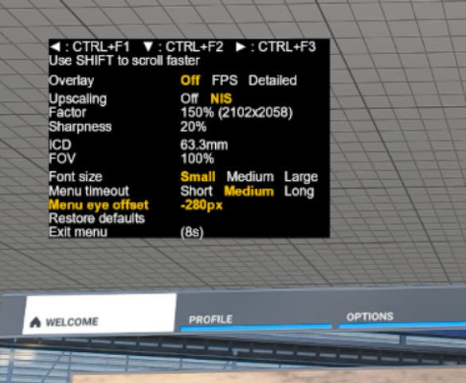

# OpenXR Toolkit

This software provides a collection of useful features to customize and improve existing OpenXR applications.

DISCLAIMER: This software is distributed as-is, without any warranties or conditions of any kind. Use at your own risks.

# Setup

## Requirements

This software may be used with any brand of VR headset as long as the target application is developed using OpenXR. This software may be used with any GPU compatible with DirectX 11 and above.

## Limitations

+ This software was only extensively tested with Microsoft Flight Simulator 2020;
+ See all [open issues](https://github.com/mbucchia/OpenXR-Toolkit/issues).

## Installation

Download the installer package from the [release page](https://github.com/mbucchia/OpenXR-Toolkit/releases).

Run the `OpenXR-Toolkit.msi` program.

Follow the instructions to complete the installation procedure.

Once installed, you can use the _OpenXR Toolkit Companion app_ (found on the desktop or Start menu) to confirm that the software is active.

The _OpenXR Toolkit Companion app_ will display a green or red status indicating whether the software is activated.

The companion app may be used sporadically to enable or disable advanced features or perform recovery (see further below). The actual settings for the toolkit are available from within your OpenXR application (see below). You do not need to open the companion app to use the software and to manage the settings.

# Using the toolkit

Once installed, please run the desired OpenXR application and use the Ctrl+F2 key combination to enter the configuration menu.

The first few times a new application is started, a reminder message will appear on the screen: it confirms that the software is operating properly.

Use Ctrl+F2 to move to the next option (next line) in the menu. Use Ctrl+F1 (respectively Ctrl+F3) to move selection left (respectively right) or decrease (respectively increase) the value of an option.

When changing the value for an option, hold Shift in addition to the Ctrl key in order to advance faster in the values.

When starting an application for the first time, use the configuration menu to adjust the _Menu eye offset_ until the text appears correctly (eg: no "double vision"):

When enabled from the _OpenXR Toolkit Companion app_, the keys Ctrl+F12 may be used to capture screenshots from the left eye view. Files are stored under `%LocalAppData%`.

## Currently available options

- **Overlay**: Enables the FPS display in the top-right corner of the view. _Please note that the overlay may reduce performance_. A third option - "_Detailed_" - is available in experimental mode and may be used for advanced performance monitoring.
- **Upscaling**: Enables the use of an upscaler such as NIS to perform rendering at a lower resolution, and upscale and/or sharpen the image.
- **Factor** (only when _Upscaling_ is enabled): The upscaling factor (ie: the percentage of magnification of the rendering resolution). The resolution display is the effective resolution that the application sees.
- **Sharpness** (only when _Upscaling_ is enabled): The sharpness factor.
- **ICD**: The Inter-Camera Distance override, which can be used to alter the world scale.
- **FOV**: The Field Of View override.
- **Font size**: The size of the text for the menu.
- **Menu timeout**: The duration after which the menu automatically disappears when there is no input.
- **Menu eye offset**: Adjust rendering of the menu until the text appears clear.

# Recovery

If changing some settings render the application unusable, use Ctrl+F1+F2+F3 to hard reset all settings. If an application can not longer start, use the _OpenXR Toolkit Companion app_ (found on the desktop or Start menu) and select the Safe mode before starting the application.

# Removal

The software can be removed from Windows' _Add or remove programs_ menu.

In the list of applications, select _OpenXR-Toolkit_, then click _Uninstall_.

